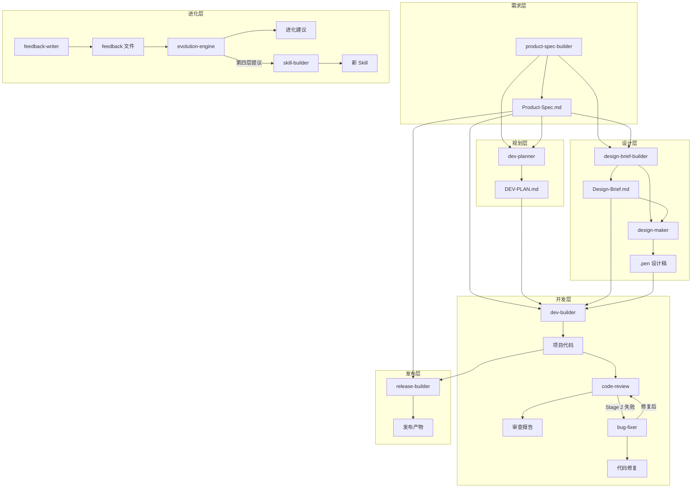

# Skill 依赖图

> 本文档定义框架中所有 Skill 之间的依赖关系。
> 在修改任何 Skill 的输入/输出格式时，必须检查此图评估影响范围。

---

## 完整依赖图 (Mermaid)



## 依赖矩阵

| Skill | 依赖的前置 Skill | 依赖的前置文件 | 被依赖的 Skill |
|-------|----------------|--------------|--------------|
| product-spec-builder | 无 | 无 | design-brief-builder, dev-planner, dev-builder, release-builder |
| design-brief-builder | product-spec-builder | Product-Spec.md | design-maker, dev-builder |
| design-maker | design-brief-builder | Product-Spec.md + Design-Brief.md | dev-planner, dev-builder |
| dev-planner | product-spec-builder | Product-Spec.md | dev-builder |
| dev-builder | dev-planner | Product-Spec.md + DEV-PLAN.md | code-review, release-builder |
| code-review | dev-builder | Product-Spec.md + 项目代码 | bug-fixer |
| bug-fixer | 无（事件触发） | 项目代码 + bug 描述 | code-review |
| release-builder | dev-builder | 项目代码 | 无 |
| skill-builder | 无（事件触发） | 无 | 无（产出新 Skill） |
| feedback-writer | 无（Sub-Agent 调用） | 无 | evolution-engine |
| evolution-engine | feedback-writer | feedback/ 目录 | skill-builder |

## 发展顺序（拓扑排序）

```
Phase 0: product-spec-builder
    ↓
Phase 1: design-brief-builder → design-maker (可选)
    ↓
Phase 2: dev-planner
    ↓
Phase 3: dev-builder → code-review ⇄ bug-fixer (review→fix 循环)
    ↓
Phase 4: release-builder
```

进化引擎（feedback-writer + evolution-engine + skill-builder）在后台并行运行，不受此顺序约束。

## 文件产出链

```
Product-Spec.md  ←  product-spec-builder
    ↓
Design-Brief.md  ←  design-brief-builder
    ↓
.pen 设计稿       ←  design-maker
    ↓
DEV-PLAN.md      ←  dev-planner
    ↓
项目代码          ←  dev-builder
    ↓
审查报告          ←  code-review
    ↓ (修复)
发布产物          ←  release-builder
```
